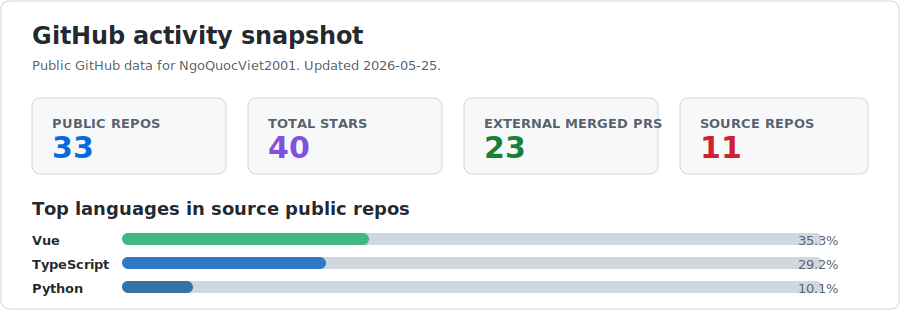

# Ngo Quoc Viet

## Building practical software that removes manual work

Fullstack Developer with nearly 4 years of experience across product and outsourced projects, with project-level Dev Lead responsibility in healthcare systems.

- Strong sense of ownership, discipline, careful reporting, and continuous improvement.
- Specialized in building custom tools, internal apps, web systems, desktop utilities, extensions, automation flows, and AI-assisted workflows.
- Comfortable taking features from requirement clarification, architecture, implementation, review, deployment, and operation support.
- Experienced with project bootstrapping, clean source structure, reusable components, Git flow, PR review, code quality, mentoring, and internal training.
- Hands-on with AWS, Linux, VPS environments, CI/CD, and deployment pipelines for staging and production systems.
- Strong foundation in JavaScript, TypeScript, C#, Node.js, React, Vue, ASP.NET, Laravel, Python, PHP, Java, Go, Rust, and SQL.

## Freelance focus

| Need | What can be delivered |
| --- | --- |
| Custom tools | File converters, data cleanup tools, reporting tools, workflow assistants, internal utilities. |
| Web apps | Admin portals, dashboards, booking systems, HR systems, survey systems, internal management apps. |
| Automation | Excel processing, repetitive browser work, deployment helpers, notification bots, data sync jobs. |
| Desktop apps | Lightweight Windows utilities, file processing apps, integration tools, business operation helpers. |
| AI workflows | Prompted workflows for BA, QC, developer productivity, document generation, test case generation. |
| Cloud delivery | Deployable applications with CI/CD, Linux/Nginx, AWS design, VPS setup, monitoring-ready structure. |

## Featured builds

| Product / Project | Focus | Signal | Link |
| --- | --- | --- | --- |
| Codex Keyring | Native multi-account manager for Codex with aliases, health checks, and failover support. | 25 stars | [GitHub](https://github.com/NgoQuocViet2001/codex-keyring) |
| Codex Observatory | Local Codex usage analytics, token trends, model breakdowns, and productivity dashboard. | 9 stars | [GitHub](https://github.com/NgoQuocViet2001/codex-observatory) |
| Google Workspace MCP | MCP server for structured Google Docs and Sheets extraction with image-aware output. | 3 stars | [GitHub](https://github.com/NgoQuocViet2001/google-workspace-mcp) |
| Dev Setup | Reproducible local development setup scripts for faster machine bootstrap. | 1 star | [GitHub](https://github.com/NgoQuocViet2001/dev-setup) |
| CAJ and Document Converter | Desktop tool for unlimited CAJ to PDF conversion and multi-format document conversion. | Product build | [Portfolio](https://viet-ngo.hinadau.vip) |
| AI Chat Bridge | App for connecting AI workflows to Discord and Telegram with simple team operation. | Product build | [Portfolio](https://viet-ngo.hinadau.vip) |
| HR Management App | Practical HR management app for small and medium businesses. | Product build | [Portfolio](https://viet-ngo.hinadau.vip) |

## Delivery highlights

- Built FE + BE source bases for a multi-tenant healthcare platform, with per-client customization and separate tenant databases.
- Led implementation guidance and code review in a 60-member project team.
- Managed delivery across 4 product modules: booking, medical record management, administrator operations, and promotion/survey.
- Built AI workflows for BA business-design generation, QC test case generation, and developer implementation support.
- Organized project-level and department-level sharing sessions about development workflow, code quality, and AI-assisted work.
- Designed CI/CD workflows with GitHub Actions for company VPS environments and supported AWS HLD planning for staging/production.

## Tech stack

### Main development stack

  

### Database, cloud, deployment

  

### AI, productivity, collaboration

## Certifications

- [AWS Certified Solutions Architect - Associate (861/1000)](https://www.credly.com/badges/b9822361-43e5-40f3-a590-a3c56a1a1d59)
- HackerRank JavaScript Basic
- HackerRank JavaScript Intermediate
- HackerRank Python Basic

## Open source work

| Project | Role | Focus | Stars | Package |
| --- | --- | --- | --- | --- |
| [codex-keyring](https://github.com/NgoQuocViet2001/codex-keyring) | Primary maintainer | Native multi-account manager for Codex with alias switching, health checks, and failover support. | 25 | [npm](https://www.npmjs.com/package/codex-keyring) |
| [codex-observatory](https://github.com/NgoQuocViet2001/codex-observatory) | Primary maintainer | Local observability and usage analytics for Codex sessions, tokens, prompts, and model trends. | 9 | [npm](https://www.npmjs.com/package/codex-observatory) |
| [google-workspace-mcp](https://github.com/NgoQuocViet2001/google-workspace-mcp) | Maintainer | MCP server for structured Google Docs and Sheets extraction with image-aware output. | 3 | - |
| [dev-setup](https://github.com/NgoQuocViet2001/dev-setup) | Maintainer | Reproducible local development setup scripts. | 1 | - |

## Merged OSS contributions

Tracked from merged external pull requests authored by `NgoQuocViet2001`. Last updated: 2026-05-20. Total tracked external merged PRs: 16.

| Project | PR | Contribution | Merged |
| --- | --- | --- | --- |
| [tinyhumansai/openhuman](https://github.com/tinyhumansai/openhuman) | [#2229](https://github.com/tinyhumansai/openhuman/pull/2229) | Enabled single-instance deep-link forwarding so already-running desktop apps receive OAuth callbacks from second launches. | 2026-05-19 |
| [ruvnet/RuView](https://github.com/ruvnet/RuView) | [#617](https://github.com/ruvnet/RuView/pull/617) | Recognized swarm provisioning flags as valid config input and covered ESP32 swarm CSV generation with tests. | 2026-05-19 |
| [Anil-matcha/Open-Generative-AI](https://github.com/Anil-matcha/Open-Generative-AI) | [#180](https://github.com/Anil-matcha/Open-Generative-AI/pull/180) | Clarified Muapi access-key creation and copy guidance in desktop onboarding and README. | 2026-05-18 |
| [Anil-matcha/Open-Generative-AI](https://github.com/Anil-matcha/Open-Generative-AI) | [#174](https://github.com/Anil-matcha/Open-Generative-AI/pull/174) | Added custom local AI storage directory support and surfaced resolved model paths in settings. | 2026-05-18 |
| [tinyhumansai/openhuman](https://github.com/tinyhumansai/openhuman) | [#1997](https://github.com/tinyhumansai/openhuman/pull/1997) | Added HMR teardown for renderer boot services and online/offline listener cleanup in Vite dev sessions. | 2026-05-17 |
| [ruvnet/RuView](https://github.com/ruvnet/RuView) | [#602](https://github.com/ruvnet/RuView/pull/602) | Documented the ESP32 mesh-to-sensing-server path that powers dashboard and Observatory views. | 2026-05-17 |
| [CJackHwang/ds2api](https://github.com/CJackHwang/ds2api) | [#483](https://github.com/CJackHwang/ds2api/pull/483) | Stripped leaked DeepSeek tool-result and control markers from OpenAI-compatible visible output. | 2026-05-10 |
| [CJackHwang/ds2api](https://github.com/CJackHwang/ds2api) | [#457](https://github.com/CJackHwang/ds2api/pull/457) | Avoided repeated lowercasing in tool-call XML ignored-section parsing, improving performance and preserving byte offsets. | 2026-05-08 |
| [mksglu/context-mode](https://github.com/mksglu/context-mode) | [#431](https://github.com/mksglu/context-mode/pull/431) | Fixed inline upgrade fallback to copy the package file list and preserve statusline binary payloads. | 2026-05-07 |
| [CJackHwang/ds2api](https://github.com/CJackHwang/ds2api) | [#430](https://github.com/CJackHwang/ds2api/pull/430) | Changed OpenAI stream keep-alives to SSE comments only, avoiding empty `choices` chunks for strict clients. | 2026-05-05 |
| [CJackHwang/ds2api](https://github.com/CJackHwang/ds2api) | [#421](https://github.com/CJackHwang/ds2api/pull/421) | Added config-backed Vercel sync credential reuse while keeping sync payloads clean. | 2026-05-04 |
| [CJackHwang/ds2api](https://github.com/CJackHwang/ds2api) | [#404](https://github.com/CJackHwang/ds2api/pull/404) | Added OpenAI-compatible uploaded file metadata retrieval endpoints and documentation. | 2026-05-02 |
| [CJackHwang/ds2api](https://github.com/CJackHwang/ds2api) | [#378](https://github.com/CJackHwang/ds2api/pull/378) | Added root OpenAI route aliases for clients configured with a bare service URL. | 2026-04-29 |
| [CJackHwang/ds2api](https://github.com/CJackHwang/ds2api) | [#373](https://github.com/CJackHwang/ds2api/pull/373) | Returned `400 Bad Request` for inline file limit validation instead of surfacing a generic server error. | 2026-04-29 |
| [CJackHwang/ds2api](https://github.com/CJackHwang/ds2api) | [#359](https://github.com/CJackHwang/ds2api/pull/359) | Fixed OpenAI citation/reference marker replacement so one-based citations are not shifted by zero-based references. | 2026-04-29 |
| [HyFrog/insight](https://github.com/HyFrog/insight) | [#19](https://github.com/HyFrog/insight/pull/19) | Contributed status-management work. | 2023-10-31 |

## GitHub activity

  

### Open to freelance projects

Custom tools, web apps, desktop utilities, extensions, automation, AI workflows, and internal systems.

[Portfolio](https://viet-ngo.hinadau.vip) . [Zalo](https://zalo.me/0971933518) . [Facebook](https://www.facebook.com/ngoquocviet2001/)

